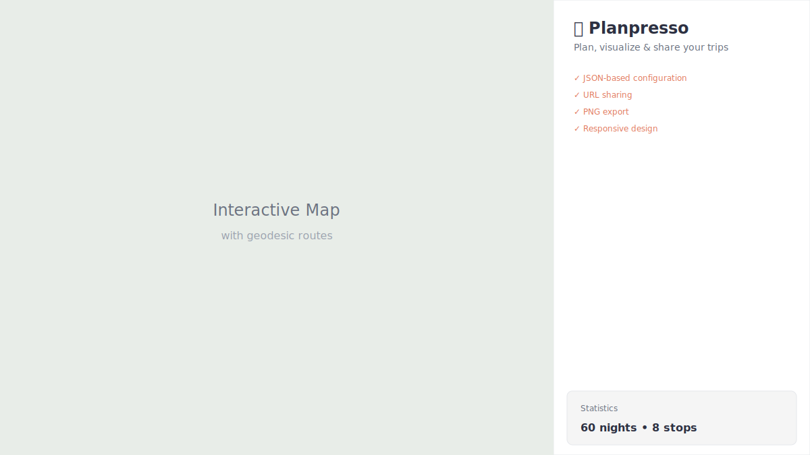

# Planpresso

[](https://choosealicense.com/licenses/mit/)
[](https://crempa.github.io/planpresso)

> Plan, visualize & share your trips



**[Live Demo](https://crempa.github.io/planpresso)**

## Features

- Interactive map with numbered markers and curved route lines
- JSON-based trip configuration - define your entire trip in a simple JSON format
- Ace Editor with JSON syntax highlighting and line numbers
- URL sharing with LZString compression - share your trip with a single link
- LocalStorage persistence - your trip is saved automatically
- PNG export - download your trip (map + timeline) as an image
- Print support - print your trip plan (Ctrl+P / Cmd+P)
- Responsive design - works on desktop and mobile
- Automatic start/end markers based on position
- Automatic night calculation from dates
- Day trip support (stops with only `dateTo`)
- Automatic marker offset - overlapping locations are automatically separated
- Date chronology validation

## Getting Started

1. Open `index.html` in your browser (or visit the [live demo](https://crempa.github.io/planpresso))
2. Paste your JSON trip definition into the editor
3. Click "Načíst plán" (Load Plan)

That's it! Your trip will be displayed on the map with all stops connected.

## JSON Schema

### Main Object

| Field | Type | Required | Description |
|-------|------|----------|-------------|
| `name` | string | Yes | Trip name (can include leading emoji, e.g., "🌴 Malaysia Trip") |
| `dateFrom` | string | No | Start date in ISO format (YYYY-MM-DD). Auto-calculated from stops if not provided. |
| `dateTo` | string | No | End date in ISO format (YYYY-MM-DD). Auto-calculated from stops if not provided. |
| `stops` | array | Yes | Array of stop objects |

### Stop Object

| Field | Type | Required | Description |
|-------|------|----------|-------------|
| `name` | string | Yes | Place name |
| `lat` | number | Yes | Latitude (-90 to 90) |
| `lng` | number | Yes | Longitude (-180 to 180) |
| `label` | string | No | Custom label for the map (defaults to `name`) |
| `dateFrom` | string | No | Arrival date (ISO format). If omitted, this is a day trip (0 nights) |
| `dateTo` | string | No | Departure date (ISO format) |
| `notes` | string | No | Notes, transfer info, tips, etc. |

**Note:** First stop is automatically marked as "🟢 Start", last stop as "🔴 Cíl" - no need to specify type.

### Example

See [examples/malaysia-trip.json](examples/malaysia-trip.json) for a complete example.

```json
{
  "name": "🏰 Weekend in Prague",
  "stops": [
    {
      "name": "Prague - Old Town",
      "lat": 50.0875,
      "lng": 14.4214,
      "dateFrom": "2025-03-01",
      "dateTo": "2025-03-02"
    },
    {
      "name": "Karlštejn Castle",
      "lat": 49.9394,
      "lng": 14.1883,
      "dateTo": "2025-03-02",
      "notes": "Day trip - no overnight stay"
    },
    {
      "name": "Prague Airport",
      "lat": 50.1008,
      "lng": 14.2600,
      "dateFrom": "2025-03-02",
      "dateTo": "2025-03-03"
    }
  ]
}
```

## Tech Stack

- [Leaflet.js](https://leafletjs.com/) - Interactive maps
- [Ace Editor](https://ace.c9.io/) - JSON editor with syntax highlighting
- [LZString](https://pieroxy.net/blog/pages/lz-string/index.html) - URL compression for sharing
- [html2canvas](https://html2canvas.hertzen.com/) - PNG export functionality
- [CartoDB Voyager](https://carto.com/basemaps/) - Beautiful light map tiles
- [Inter Font](https://rsms.me/inter/) - Clean typography

## Contributing

Contributions are welcome! Here's how you can help:

1. Fork the repository
2. Create a feature branch (`git checkout -b feature/amazing-feature`)
3. Commit your changes (`git commit -m 'Add amazing feature'`)
4. Push to the branch (`git push origin feature/amazing-feature`)
5. Open a Pull Request

## Acknowledgments

- [Leaflet](https://leafletjs.com/) team for the amazing mapping library
- [CARTO](https://carto.com/) for the beautiful Voyager map tiles
- [pieroxy](https://github.com/pieroxy) for LZString compression library
- [Niklas von Hertzen](https://hertzen.com/) for html2canvas
- [Ace](https://ace.c9.io/) team for the code editor

## License

This project is licensed under the MIT License - see the [LICENSE](LICENSE) file for details.
